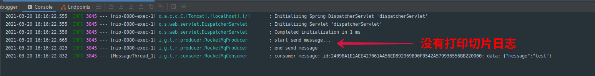
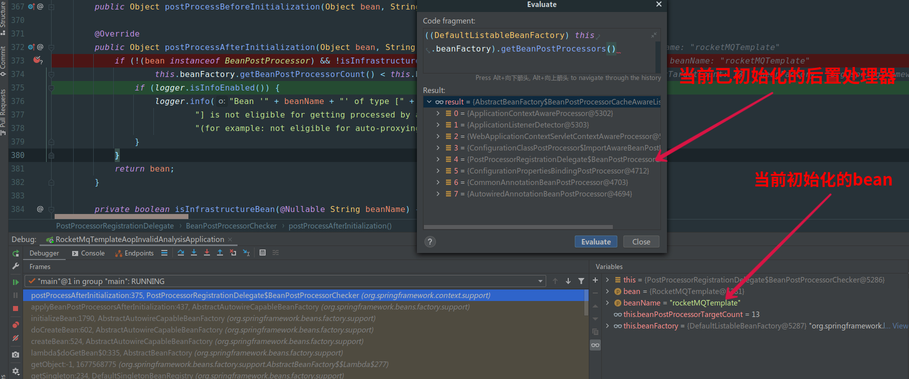

# rocketMqTemplate aop 失效分析

## 项目启动

### rocketMq安装

#### 1.  安装&启动 NameServer

```bash
docker run -d -p 9876:9876 --name rmqserver  foxiswho/rocketmq:server-4.5.1
```

#### 2. 安装&启动 Broker

```bash
docker run -d -p 10911:10911 -p 10909:10909\
 --name rmqbroker --link rmqserver:namesrv\
 -e "NAMESRV_ADDR=namesrv:9876" -e "JAVA_OPTS=-Duser.home=/opt"\
 -e "JAVA_OPT_EXT=-server -Xms128m -Xmx128m"\
 foxiswho/rocketmq:broker-4.5.1
```

#### 3. 安装 RocketmqConsole

```bash
docker run -d --name rmqconsole -p 8180:8080 --link rmqserver:namesrv\
 -e "JAVA_OPTS=-Drocketmq.namesrv.addr=namesrv:9876\
 -Dcom.rocketmq.sendMessageWithVIPChannel=false"\
 -t styletang/rocketmq-console-ng
```

#### 4. 查看 rocketMq 是否安装成功

[http://127.0.0.1:8180](http://127.0.0.1:8180)

## 切片失效场景复现

1. 设置 rocketmq-spring-boot-starter.version < 2.1.0

2. 添加切片
```java
package io.github.tanghuibo.rocketmqtemplateaopinvalidanalysis.aspect;

import com.alibaba.fastjson.JSON;
import org.aspectj.lang.JoinPoint;
import org.aspectj.lang.annotation.After;
import org.aspectj.lang.annotation.Aspect;
import org.slf4j.Logger;
import org.slf4j.LoggerFactory;
import org.springframework.messaging.Message;
import org.springframework.stereotype.Component;

/**
 * @author tanghuibo
 * @date 2021/3/20下午3:44
 */
@Aspect
@Component
public class RocketMqLogAspect {

    Logger log = LoggerFactory.getLogger(RocketMqLogAspect.class);
    @After("execution(void org.springframework.messaging.core.AbstractMessageSendingTemplate.send(..))")
    public void log(JoinPoint joinPoint) {
        Object[] args = joinPoint.getArgs();
        if(args.length == 1) {
            if(args[0] instanceof Message) {
                log.info("rocketmq send message: {}", JSON.toJSONString(((Message)args[0]).getPayload()));
            }
        } else if(args.length == 2) {
            if(args[1] instanceof Message) {
                log.info("rocketmq send message: topic {}, data: {}", args[0], JSON.toJSONString(((Message)args[1]).getPayload()));
            }
        }
    }
}
```

3. 访问 http://127.0.0.1:8080/message/send?message=test

理论上会对 rocketMqTemplate.send 方法进行从而打印日志，但日志并没有打出来



仔细观察启动时有一行关于rocketMqTemplate的信息:

```log
2021-03-20 16:26:27.492  INFO 7024 --- [           main] trationDelegate$BeanPostProcessorChecker : Bean 'rocketMQTemplate' of type [org.apache.rocketmq.spring.core.RocketMQTemplate] is not eligible for getting processed by all BeanPostProcessors (for example: not eligible for auto-proxying)
```

日志告诉我们rocketMqTemplate可能无法 aop 切片

找到日志打印位置

```java
@Override
public Object postProcessAfterInitialization(Object bean, String beanName) {
    if (!(bean instanceof BeanPostProcessor) && !isInfrastructureBean(beanName) &&
            this.beanFactory.getBeanPostProcessorCount() < this.beanPostProcessorTargetCount) {
        if (logger.isInfoEnabled()) {
            logger.info("Bean '" + beanName + "' of type [" + bean.getClass().getName() +
                    "] is not eligible for getting processed by all BeanPostProcessors " +
                    "(for example: not eligible for auto-proxying)");
        }
    }
    return bean;
}
```

bean 在初始化时如果当前的后置处理器数量小于容器加载完毕的目标后置处理器数量就可能无法被 aop; 因为 aop 也是依赖于后置处理器 `AbstractAdvisorAutoProxyCreator` 实现的

而在初始化 `rocketMqTemplate` 时，`AbstractAdvisorAutoProxyCreator` 并没有完成初始化



为什么 `rocketMqTemplate` 会在 `AbstractAdvisorAutoProxyCreator` 之前完成初始化呢?

因为后置处理器 `RocketMQTransactionAnnotationProcessor` 依赖了 `rocketMqTemplate`

## 如何解决rocketMqTemplate aop 失效问题

1. 升级 rocketmq-spring-boot-starter.version > 2.1.0

rocketmq-spring-boot-starter 2.1.0 时删除了 `RocketMQTransactionAnnotationProcessor`, aop 失效问题完美解决

2. `手动` 后置处理 (不推荐)


```java
public class RocketMqProducer {
    
    @Resource
    RocketMQTemplate rocketMqTemplate;

    @Resource
    AbstractAdvisorAutoProxyCreator abstractAdvisorAutoProxyCreator;

    @PostConstruct
    public void init() {
        //手动添加后置处理
        rocketMqTemplate = (RocketMQTemplate)abstractAdvisorAutoProxyCreator.postProcessAfterInitialization(rocketMqTemplate, "rocketMqTemplate");
    }

}

```


